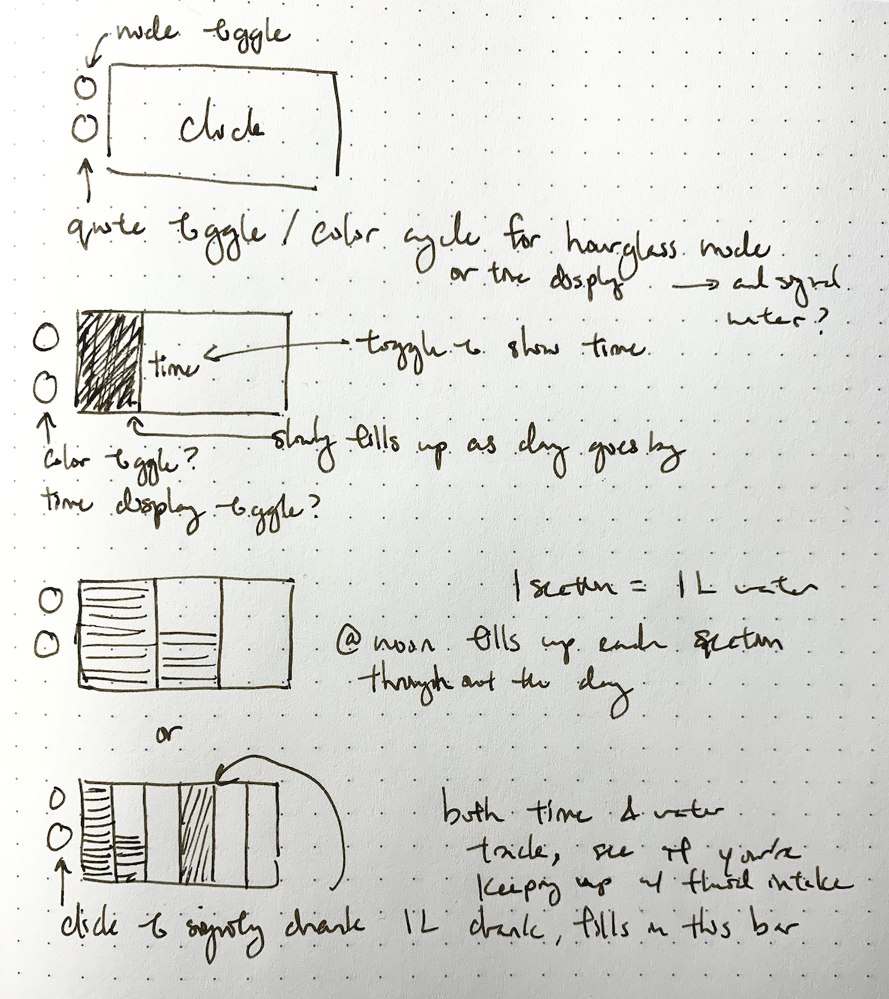

# Interactive Prototyping: The Clock of Pi

## Part E.
### Modify the barebones clock to make it your own

\*\*\***A copy of your code should be in your Lab 2 Github repo.**\*\*\*

I created a lyrics clock, because I wanted it to be a little fun. Checking the time is sometimes stressful for me, but I love music, so maybe having lyrics would make it less stressful. 

At every hour, there is a lyric that contains the hour in the lyric itself, and it is highlighted in a different color. When the hour changes, the next hour's lyric will pop up. The clock also has the date above the lyrics, and minutes:seconds below the lyrics.

## Part F. 
## Make a short video of your modified barebones PiClock
Time change from 6pm to 7pm:

https://user-images.githubusercontent.com/14368010/134089019-7e18a2c9-3b71-4b5e-974c-c293b6cbf55a.mp4

## Part G. 
## Sketch and brainstorm further interactions and features you would like for your clock for Part 2.
While finding lyrics that have the hours in them was fun, I'm prefer something different for part 2. 

Features:
- Have a set of motivational quotes and cycle through them. Change quotes when the hour changes, and also when pressing one of the buttons.
- Have the other other toggle between 3-4 modes. Mode ideas: 
  - lyrics mode
  - quote mode
  - visual mode: make the screen fill up throughout the day from midnight to midnight like an hourglass
  - water drinking mode: everyone should have about 3 liters of water a day, break up the screen into 3 sections and based on the time, fill up the 3 sections as a reminder of how much water to drink.

# Prep for Part 2

1. Pick up remaining parts for kit on Thursday lab class. Check the updated [parts list inventory](partslist.md) and let the TA know if there is any part missing.
  

2. Look at and give feedback on the Part G. for at least 2 other people in the class (and get 2 people to comment on your Part G!)

# Lab 2 Part 2

Pull Interactive Lab Hub updates to your repo.

Modify the code from last week's lab to make a new visual interface for your new clock. You may [extend the Pi](Extending%20the%20Pi.md) by adding sensors or buttons, but this is not required.

As always, make sure you document contributions and ideas from others explicitly in your writeup.

You are permitted (but not required) to work in groups and share a turn in; you are expected to make equal contribution on any group work you do, and N people's group project should look like N times the work of a single person's lab. What each person did should be explicitly documented. Make sure the page for the group turn in is linked to your Interactive Lab Hub page. 

